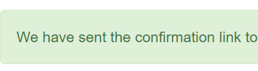
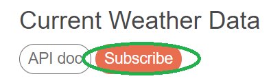
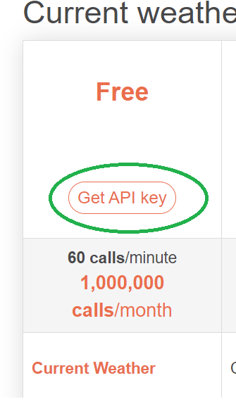

# Weather-tracking
Weather tracking application in Python using OpenWeatherMap API

Presented application was based on free API (authentication is required) - 1,000 API calls per day for free:
https://openweathermap.org/api

### Additional information
 1) ,,main" branch is relevant to CLI version of APP. Other versions of application will be added as separate  branches

## Installation & preconfiguration
For authentication purpose please follow below instruction (need to be done before start follow execute section)
1) Sign up using below link: https://openweathermap.org/api
2) Confirm your email using invitation email

3) Select below version:

4) Than select below option:

5) Copy your own key (it should be provided you by new email)

## Execute instruction
1) Paste your own key into **API_key.json** file instead of ,,**YOUR OWN API KEY**" string located under **key** item
2) To be defined...